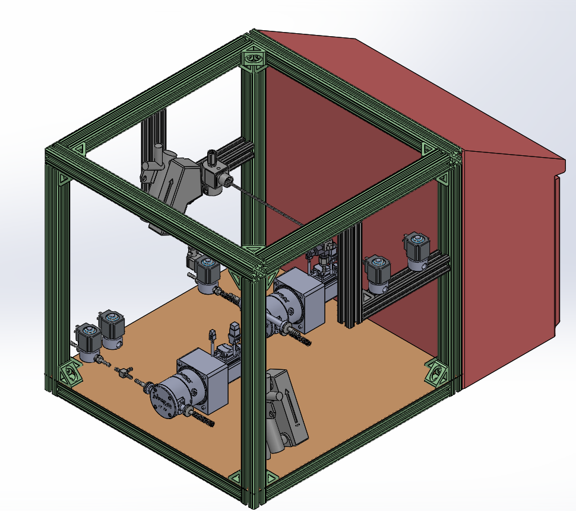
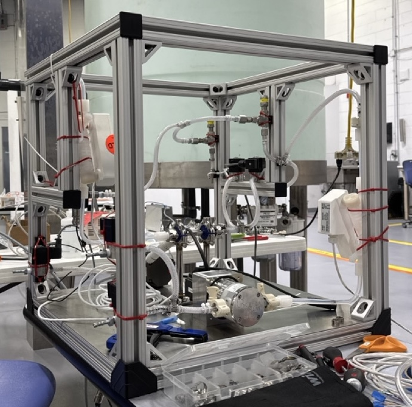

## Glenview, IL | Jun 2025 – Aug 2025 
- **Designed and built AKBA’s first benchtop buffer-dilution system**, creating a fully functional prototype for testing and client demos.  
- **Standardized a pressurized-vessel product line** by aggregating critical parameters from custom projects, cutting costs and improving lead times.  
- **Improved drawings and BOMs** by correcting tolerances, refreshing legacy callouts, and clarifying hardware specs to streamline procurement and assembly.

  
  

 
